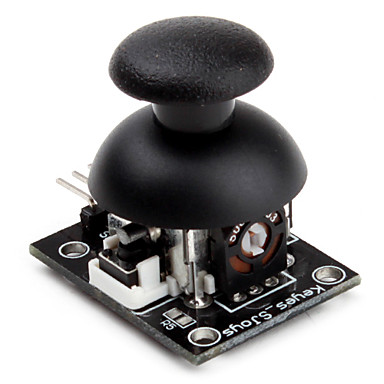
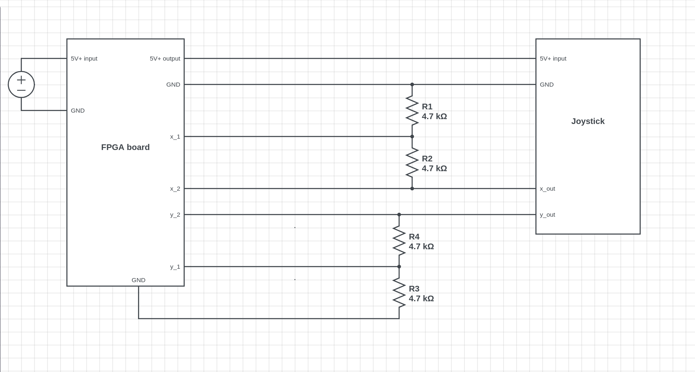
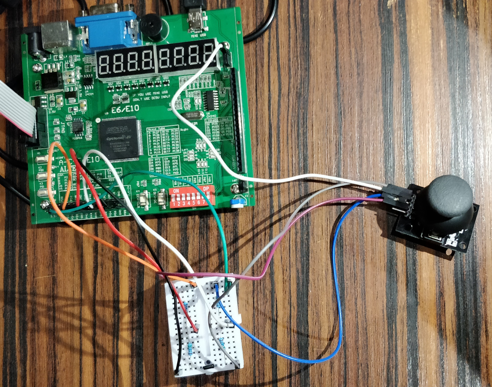

# The Snake game for FPGA Cyclone IV (with VGA & SPI joystick)

## Introduction

Do you remember the [snake game](https://en.wikipedia.org/wiki/Snake_(video_game_genre)) from childhood, where a snake runs on the screen trying to eat an apple? This article describes our implementation of the game on an FPGA<sup>[1](#1)</sup>.

First, let us introduce ourselves and explain the rationale why we have worked on the project. There are 3 of us: [Tymur Lysenko](https://github.com/Sitiritis), [Daniil Manakovskiy](https://github.com/WinnerOK) and [Sergey Makarov](https://github.com/SgMakarov). As first-year students of [Innopolis University](https://university.innopolis.ru/en/), we have had a course in "Computer Architecture", which is taught professionally and can allow the learner to comprehend the low level structure of a computer. At some point during the course, the instructors provided us with the opportunity to develop a project for an FPGA for additional points in the course. Our motivation has not been only the grade, but our interest to gain more experience in the hardware design, share the outcomes, and finally, having an enjoyable game :)

Now, let us go into dark deep details.

## Project overview

For our project, we selected an easily-implemented and fun game, namely the "Snake". The structure of the the implementation goes as follows: firstly, an input is taken from an SPI joystick, then processed, and finally, a picture is output to a VGA monitor and a score is shown on a 7-segment display (in hex). Although, the game logic is intuitive and straightforward, VGA and the joystick have been interesting challenges and their implementation has led to a good gaming experience.


Figure 1. Gameplay

The game has the following rules. A player starts with a single snake's head. The goal is to eat apples, which are randomly generated on the screen after the previous one was eaten. Furthermore, the snake is being extended by 1 tail after satisfying the hunger. The tails move one after another, following the head. The snake is always moving. If the screen borders are reached, the snake is being transferred to another side of the screen. If the head hits the tail, the game is over.

## Tools used
- Altera Cyclone IV (EP4CE6E22C8N) with 6272 logical elements, on-board 50 MHz clock, 3-bit color VGA, 8 digit 7-segment display. The FPGA cannot take an analog input to its pins.
- SPI Joystick (KY-023)
- A VGA monitor that supports 60 Hz refresh rate
- Quartus Prime Lite Edition 18.0.0 Build 614
- Verilog HDL IEEE 1364-2001
- Breadboard
- Electrical elements:
  - 8 male-female connectors
  - 1 female-female connector
  - 1 male-male connector
  - 4 resistors (4.7 KΩ)

## Architecture overview

The architecture of the project is a significant factor to consider. Figure 2 shows this architecture from the top level point of view:

<a href="Design.pdf">


Figure 2. Top-level view of the design

</a>

As you can see, there are many inputs, outputs, and some modules. This section will describe what each element means and specify which pins are used on the board for the ports.

### Main inputs

The main inputs needed for the implementation are *res_x_one*, *res_x_two*, *res_y_one*, *res_y_two*, which are used to receive a current direction of a joystick. Figure 3 shows the mapping between their values and the directions.

| Input     | Left | Right | Up | Down | No change in direction |
|-----------|:----:|:-----:|:--:|:----:|:----------------------:|
| res_x_one (PIN_30) |1|0|x|x|1|
| res_x_two (PIN_52) |1|0|x|x|0|
| res_y_one (PIN_39) |x|x|1|0|1|
| res_y_two (PIN_44) |x|x|1|0|0|

Figure 3. Mapping of joystick inputs and directions

### Other inputs

- *clk* - the board clock (PIN_23)
- *reset* - signal to reset the game and stop printing (PIN_58)
- *color* - when 1, all possible colours are output to the screen and used only for demonstration purposes (PIN_68)

### Main modules

#### joystick_input

*joystick_input* is used to produce a direction code based on an input from the joystick.

#### game_logic

*game_logic* contains all the logic needed to play a game. The module moves a snake into a given direction. Additionally, it is responsible for an apple eating and collision detection. Furthermore, it receives the current x and y coordinates of a pixel on the screen and returns an entity placed at the position.

#### VGA_Draw

The drawer sets a color of a pixel to a particular value based on the current position (_iVGA\_X, iVGA\_Y_) and current entity (_ent_).

#### VGA_Ctrl

Generates a control bitstream to VGA output (_V\_Sync, H\_Sync, R, G, B_).

#### SSEG_Display<sup>[2](#2)</sup>

*SSEG_Display* is a driver to output current score on the 7-segment display.

#### VGA_clk

*VGA_clk* receives a 50MHz clock and cuts it down to 25.175 MHz.

#### game_upd_clk

*game_upd_clk* is a module that generates a special clock which triggers an update of a game state.

### Outputs

- *VGA_B* - VGA blue pin (PIN_144)
- *VGA_G* - VGA green pin (PIN_1)
- *VGA_R* - VGA red pin (PIN_2)
- *VGA_HS* - VGA horizontal synchronization (PIN_142)
- *VGA_VS* - VGA vertical synchronization (PIN_143)
- *sseg_a_to_dp* - specifies which of the 8 segments to light (PIN_115, PIN_119, PIN_120, PIN_121, PIN_124, PIN_125, PIN_126, PIN_127)
- *sseg_an* - specifies which of the 4 7-segment displays are to be used (PIN_128, PIN_129, PIN_132, PIN_133)

## Implementation

### Input with SPI joystick



Figure 4. SPI Joystick (KY-023)

While implementing an input module, we found out that the stick produces an analog signal. The joystick has 3 positions for each axis:

- top — ~5V output
- mid — ~2.5V output
- low — ~0V output

The input is very similar to the ternary system: for the X-axis, we have `true` (left), `false` (right) and an `undetermined` state, where the joystick is neither on the left nor on the right. The problem is that the FPGA board can only process a digital input. Therefore we cannot convert this ternary logic to binary just by writing some code. The first suggested solution was to find an Analog-Digital converter, but then we decided to use our school knowledge of physics and implement the voltage divider<sup>[3](#3)</sup>. To define the three states, we will need two bits: 00 is `false`, 01 is `undefined` and 11 is `true`. After some measurements we found out that on our board, the border between zero and one is approximately 1.7V. Thus, we built the following scheme (image created using circuitlab<sup>[4](#4)</sup>):



Figure 5. Circuit for ADC for joystick

The physical implementation is built from an Arduino kit items, and looks as follows:



Figure 6. ADC implementation

Our circuit takes one input for each axis and produces two outputs: the first comes directly from the stick and becomes zero only if the joystick outputs `zero`. The second is 0 at `undetermined` state, but still 1 at `true`. This the exact result we expected.

The logic of the input module is:

1. We translate our ternary logic to simple binary wires for each direction;
2. At each clock cycle, we check whether only one direction is `true` (the snake cannot go by diagonal);
3. We compare our new direction with the previous one to prevent the snake from eating itself by not allowing the player to change the direction into the opposite one.

<details>
<summary>A part of the input module code</summary>

```Verilog
reg left, right, up, down;

initial
begin
	direction = `TOP_DIR;
end

always @(posedge clk)
begin
	//1
	left = two_resistors_x;
	right = ~one_resistor_x;
	up = two_resistors_y;
	down = ~one_resistor_y;
	if (left + right + up + down == 3'b001) //2
	begin
		if (left && (direction != `RIGHT_DIR)) //3
		begin
			direction = `LEFT_DIR;
		end
		//same code for other directions
	end
end
```

</details>

### Output to VGA
We decided to make an output with resolution 640x480 at 60Hz screen running at 60 FPS.

VGA module consists of 2 main parts: a **driver** and a **drawer**. The driver generates a bitstream consisting of vertical, horizontal synchronization signals, and a color that is given to VGA outputs. An article<sup>[5](#5)</sup> written by [@SlavikMIPT](https://habr.com/users/SlavikMIPT/) describes the basic principles of working with VGA. We have adapted the driver from the article to our board.

We decided to break down the screen into a 40x30 elements grid, consisting of squares 16x16 pixels. Each element stands for 1 game entity: either an apple, a snake's head, a tail or nothing.

The next step in our implementation was to create sprites for the entities.

Cyclone IV has only 3 bits to represent a color on VGA (1 for Red, 1 for Green, and 1 for Blue). Due to such a limitation, we needed to implement a converter to fit the colors of images into the available ones. For that purpose, we created a python script that divides an RGB value of every pixel by 128.

<details>
<summary>The python script</summary>

```Python
from PIL import Image, ImageDraw

filename = "snake_head"
index = 1

im = Image.open(filename + ".png")
n = Image.new('RGB', (16, 16))
d = ImageDraw.Draw(n)

pix = im.load()
size = im.size

data = []

code = "sp[" + str(index) + "][{i}][{j}] = 3'b{RGB};\\\n"

with open("code_" + filename + ".txt", 'w') as f:
	for i in range(size[0]):
		tmp = []
		for j in range(size[1]):
			clr = im.getpixel((i, j))
			vg = "{0}{1}{2}".format(int(clr[0] / 128),  # an array representation for pixel
									int(clr[1] / 128),  # since clr[*] in range [0, 255],
									int(clr[2] / 128))  # clr[*]/128 is either 0 or 1
			tmp.append(vg)
			f.write(code.format(i=i, j=j, RGB=vg))  # Verilog code to initialization
			d.point((i, j), tuple([int(vg[0]) * 255, int(vg[1]) * 255, int(vg[2]) * 255]))  # Visualize final image
		data.append(tmp)

n.save(filename + "_3bit.png")

for el in data:
	print(" ".join(el))

```
</details>

<table>
  <tr align="center">
    <td>Original</td>
    <td>After the script</td>
  </tr>
  <tr align="center">
    <td height="128" width="150">
      
    </td>
    <td height="128" width="150">
      
    </td>
  </tr>
</table>

Figure 7. Comparison between input and output

The main purpose of the drawer is to send a color of a pixel to VGA based on the current position (_iVGA_X, iVGA_Y_) and the current entity (_ent_). All sprites are hard-coded but can be easily changed by generating a new code using the script above.

<details>
<summary>Drawer logic</summary>

```Verilog
always @(posedge iVGA_CLK or posedge reset)
begin
	if(reset)
	begin
		oRed   <= 0;
		oGreen <= 0;
		oBlue  <= 0;
	end
	else
	begin
		// DRAW CURRENT STATE
		if (ent == `ENT_NOTHING)
		begin
			oRed   <= 1;
			oGreen <= 1;
			oBlue  <= 1;
		end
		else
		begin
			// Drawing a particular pixel from sprite
			oRed <= sp[ent][iVGA_X % `H_SQUARE][iVGA_Y % `V_SQUARE][0];
			oGreen <= sp[ent][iVGA_X % `H_SQUARE][iVGA_Y % `V_SQUARE][1];
			oBlue <= sp[ent][iVGA_X % `H_SQUARE][iVGA_Y % `V_SQUARE][2];
		end
	end
end
```

</details>

### Output to the 7-segment display

For the purpose of enabling the player to see their score, we decided to output a game score to the 7-segment display. Due to shortage of time, we used the code from EP4CE6 Starter Board Documentation<sup>[2](#2)</sup>. This module outputs a hexadecimal number to the display.

### Game logic

During the development, we tried several approaches, however, we ended up with the one that requires a minimal amount of memory, is easy to implement in hardware, and can benefit from parallel computations.

The module performs several functions. As VGA draws a pixel at each clock cycle starting from the upper left one moving to the lower right one, the VGA_Draw module, which is responsible for producing a color for a pixel, needs to identify which color to use for the current coordinates. That is what the game logic module should output - an entity code for the given coordinates.
Moreover, it has to update the game state only after the full screen was drawn. A signal produced by *game_upd_clk* module is used to determine when to update.

#### Game state

The game state consists of:
  - Coordinates of the snake's head
  - An array of coordinates of the snake's tail. The array is limited by 128 elements in our implementation
  - Number of tails
  - Coordinates of an apple
  - Game over flag
  - Game won flag

The update of the game state includes several stages:
  1. Move the snake's head to new coordinates, based on a given direction. If it turns out that a coordinate is on its edge and it needs to be changed further, then the head has to jump to another edge of the screen. For example, a direction is set to the left, and the current X coordinate is 0. Therefore, the new X coordinate should become equal to the last horizontal address.
  2. New coordinates of the snake's head are tested against apple coordinates:  
    2.1. In case they are equal and the array is not full, add a new tail to the array and increment the tail counter. When the counter reaches its highest value (128 in our case), the game won flag is being set up and that means, that snake cannot grow anymore, and the game still continues. The new tail is placed on the previous coordinates of the snake's head. Random coordinates for X and Y should be taken to place an apple there.  
    2.2. In case they are not equal, sequentially swap coordinates of the adjacent tails. (n + 1)-th tail should receive coordinates of n-th, in case the n-th tail was added before (n + 1)-th. The first tail receives old coordinates of the head.
  3. Check, if the new coordinates of the snake's head coincide with the coordinates of any tail. If that is the case, the game over flag is raised and the game stops.

#### Random coordinate generation

Random numbers produced by taking random bits generated by 6-bit _linear-feedback shift registers (LFSR)_<sup>[6](#6)</sup>. To fit the numbers into a screen they are being divided by the dimensions of the game grid and the remainder is taken.

## Conclusion

After 8 weeks of work, the project was successfully implemented. We have had some experience in game development and ended up with an enjoyable version of a "Snake" game for an FPGA. The game is playable, and our skills in programming, designing an architecture and soft-skills have improved.

## Acknowledgements

We would like to express our special thanks and gratitude to our professors [Muhammad Fahim](https://scholar.google.com/citations?user=HFp8hzMAAAAJ) and [Alexander Tormasov](https://scholar.google.com/citations?user=bsy2_u0AAAAJ) for giving us the profound knowledge and the opportunity to put it into practice. We heartily thank [Vladislav Ostankovich](https://github.com/vladostan/) for providing us with the essential hardware used in the project and [Temur Kholmatov](https://github.com/temur-kh/) for helping with debugging. We would not forget to remember [Anastassiya Boiko](https://github.com/Rikitariko) drawing beautiful sprites for the game. Also, we would like to extend our sincere esteems to [Rabab Marouf](https://www.researchgate.net/profile/Rabab_Marouf) for the proofreading and editing this article.

Thanks for all those who helped us test the game and tried to set record. Hope you enjoy playing it!

## References

<a name="1"></a>[1]: [Project on the Github](https://github.com/Sitiritis/SnakeGame_FPGA)  
<a name="2"></a>[2]: [\[FPGA\] EP4CE6 Starter Board Documentation](https://drive.google.com/file/d/0B29qKrGuvpGDcEx3QjVUNG9qRVE/view)  
<a name="3"></a>[3]: [Voltage divider](http://www.joyta.ru/7328-delitel-napryazheniya-na-rezistorax-raschet-onlajn)  
<a name="4"></a>[4]: [Tool for modelling circuits](https://circuitlab.com)  
<a name="5"></a>[5]: [VGA адаптер на ПЛИС Altera Cyclone III](https://habr.com/post/157863/)  
<a name="6"></a>[6]: [Linear-feedback shift register (LFSR) on Wikipedia](https://en.wikipedia.org/wiki/Linear-feedback_shift_register)  
[LFSR in an FPGA - VHDL & Verilog Code](https://www.nandland.com/vhdl/modules/lfsr-linear-feedback-shift-register.html)  
[An apple texture](https://winterlynx.itch.io/dungeon-crawler-24-pack)  
[Idea to generate random numbers](http://simplefpga.blogspot.com/2013/02/random-number-generator-in-verilog-fpga.html)  
Palnitkar, S. (2003). _Verilog HDL: A Guide to Digital Design and Synthesis, Second Edition._
